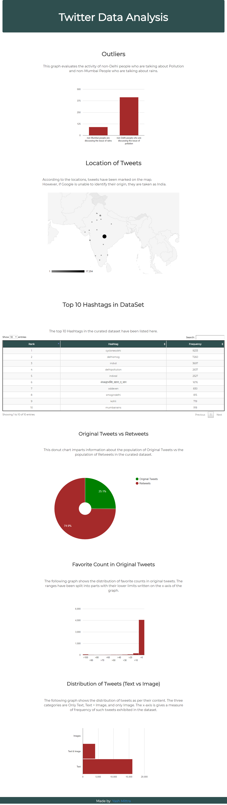

# Twitter-Data-Analysis
A twitter data analysis project which uses Tweepy for data retrieval, MongoDB as storage and Flask for back-end.

Precog - Task A

    To test, just clone and run main.py  
    Next, go on to http://localhost:5000  
    No need to run all the files to create collections.  
    The collections have been uploaded to and referenced from a remote server.  

